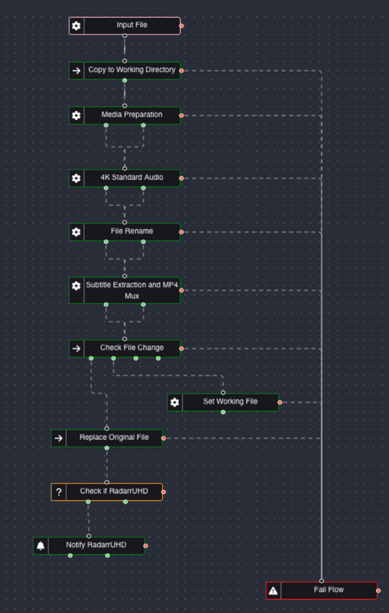

# 4K Movies

This library preserves UHD video quality while standardizing audio for consistent home theater playback.

Unlike the HD Movie and TV libraries, 4K content is intentionally left as close to the original source as possible. Quality selection is performed upstream by Radarr using Custom Formats and Quality Profiles. Tdarr performs only the minimum processing necessary to normalize audio before handing the file to the Shared Processing pipeline.

## Processing Flow

---

# Design Philosophy

- Preserve original UHD video quality.
- Never transcode compliant video.
- Standardize surround audio for consistent playback.
- Keep processing to the absolute minimum.
- Rely on Radarr for content acquisition and quality selection.

---

# Video Standard

No video transcoding is performed.

The library relies on Radarr to acquire compliant UHD releases through Custom Formats and Quality Profiles.

Video is preserved exactly as downloaded.

---

# Audio Standard

Only a single surround track is retained.

## Preferred Format

- EAC3 5.1

## Accepted Format

- AC3 5.1

## Audio Rules

- Keep only one surround track.
- Prefer the highest quality surround track.
- Prioritize channel count before codec quality.
- Prefer EAC3 over AC3.
- Convert unsupported surround codecs to EAC3 5.1.
- Normalize all surround audio to 5.1.
- Remove all additional audio tracks.
- Do not create a stereo fallback.

---

# Expected Output

## Video

- Original UHD video
- Original resolution
- Original HDR / Dolby Vision preserved
- Original video codec preserved

## Audio

- Single EAC3 5.1 surround track (preferred)
- Single AC3 5.1 surround track (accepted if already compliant)

---

# Workflow

After 4K audio standardization is complete, the file enters the Shared Processing pipeline for final packaging and library integration.

See **../Shared/README.md** for the complete shared processing workflow.

Following Shared Processing, the completed file is routed to the appropriate Radarr instance by **FUNCTION_Radarr_Router.js** based on its original library location.
