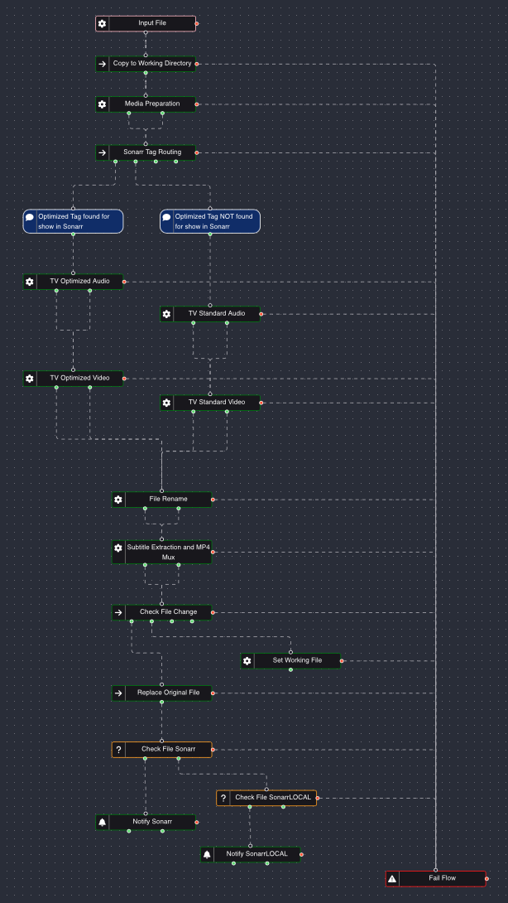

# TV Shows

This library standardizes television content for consistent playback while balancing storage efficiency and media quality.

Unlike the Movie libraries, TV content varies significantly in source quality, codecs, bitrates, and audio layouts. Tdarr is responsible for normalizing this content into predictable playback standards using one of two processing policies selected by the Sonarr Tag Router.

## Processing Flow

---

# Design Philosophy

- Normalize inconsistent television releases.
- Eliminate unnecessary storage consumption.
- Maximize Direct Play compatibility.
- Apply different processing policies based on library requirements.
- Rely on Sonarr tags to automatically select the appropriate workflow.

---

# TV Optimized

Designed for libraries where storage efficiency is the primary objective.

## Video Standard

- Supports H.264 and HEVC.
- Unsupported codecs are converted to HEVC.
- Resolution-aware bitrate optimization.
- Only oversized encodes are transcoded.

## Audio Standard

Output is standardized to a single audio track.

### Expected Output

- AAC 2.0 only

## Intended Use

- Shared libraries
- Long-running television series
- Maximum storage efficiency
- Universal playback compatibility

---

# TV Standard

Designed for libraries where playback quality is prioritized over storage savings.

## Video Standard

- Supports H.264 and HEVC.
- Unsupported codecs are converted to HEVC.
- Higher bitrate thresholds than TV Optimized.
- Resolution-aware bitrate optimization.

## Audio Standard

Maintains both surround and stereo playback support.

### HD Content (720p+)

- AC3 5.1
- AAC 2.0

### SD Content (<720p)

- AAC 2.0 only

Surround audio is preserved whenever available while ensuring a compatible stereo fallback.

## Intended Use

- Personal libraries
- Higher quality television content
- Home theater playback

---

# Workflow

Each file is first evaluated by **FUNCTION_Sonarr_Tag_Router.js**.

- **optimized-tv** tag → TV Optimized workflow
- No **optimized-tv** tag → TV Standard workflow

After media-specific processing is complete, the file enters the Shared Processing pipeline for final packaging and library integration.

See **../Shared/README.md** for the complete shared processing workflow.
